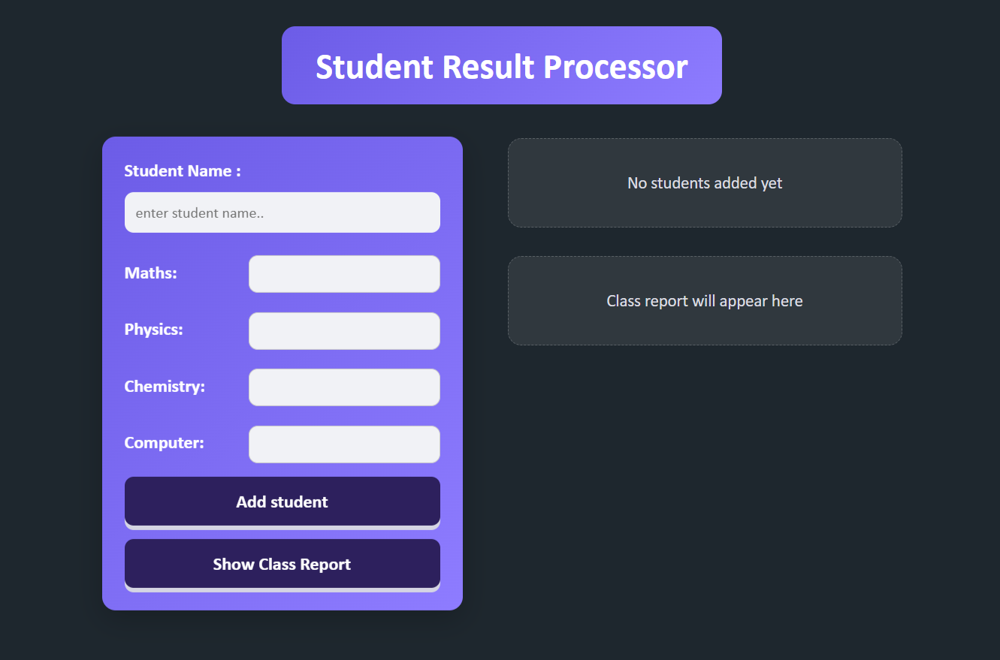
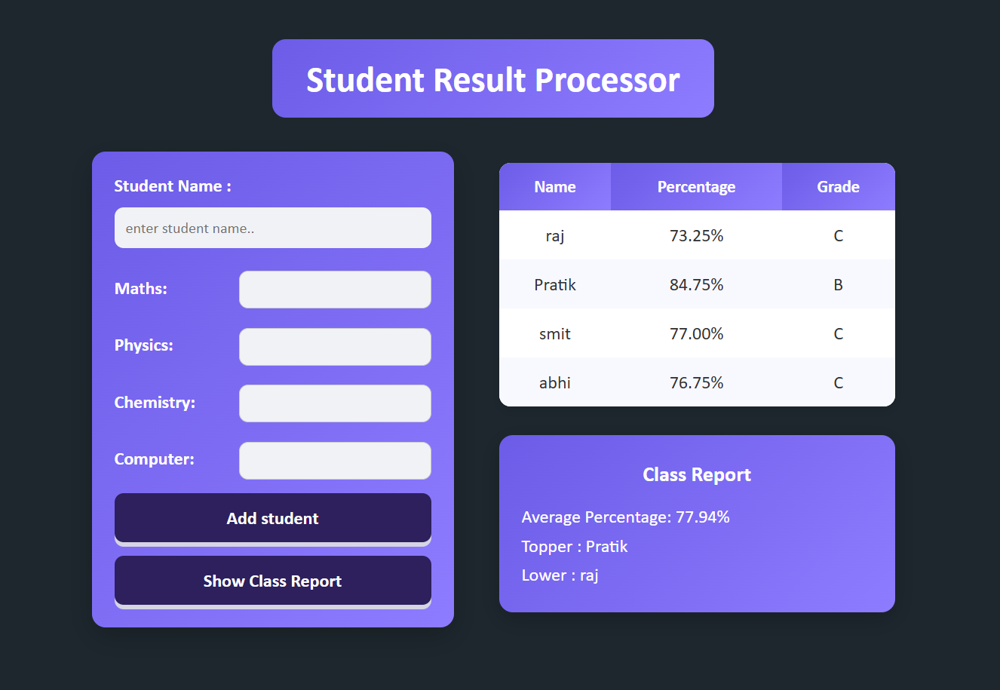

# 🧑‍🎓 Student Result Processor

- A simple web-based application to manage student marks, calculate percentages, assign grades, and generate a class performance report.

## 🚀 Features

- ➕ Add student details (Name + 4 subjects)
- 📊 Automatically calculate percentage
- 🏷️ Assign grades based on performance
- 📋 Display student data in a table
- 📈 Generate class report:
    - Average percentage
    - Topper (highest score)
    - Lowest scorer
- ⚡ Instant feedback using toast notifications
- ⌨️ Press Enter key to quickly add a student
- 🎯 Input validation:
    - No empty fields
    - Marks must be between 0–100
    - No duplicate student names

## 👨‍🔧 Technologies Used
- HTML5 – Structure
- CSS3 – Styling & layout (Flexbox, Grid)
- JavaScript (Vanilla JS) – Logic & DOM manipulation

## 🚀 How It Works
- Enter student name
- Enter marks (0–100) for:
    - Maths
    - Physics
    - Chemistry
    - Computer
- Click "Add Student"
- Student data appears in the table
- Click "Show Class Report" to view:
    - Total students
    - Average percentage
    - Topper
    - Lowest scorer

## ⚠️ Validation
- ❌ Name cannot be empty
- ❌ Duplicate student names are not allowed
- ❌ Marks cannot be empty
- ❌ Marks must be between 0 and 100

## 📸 Screenshot

## 👨‍💻 Author

- Developed by Pratik Jetani