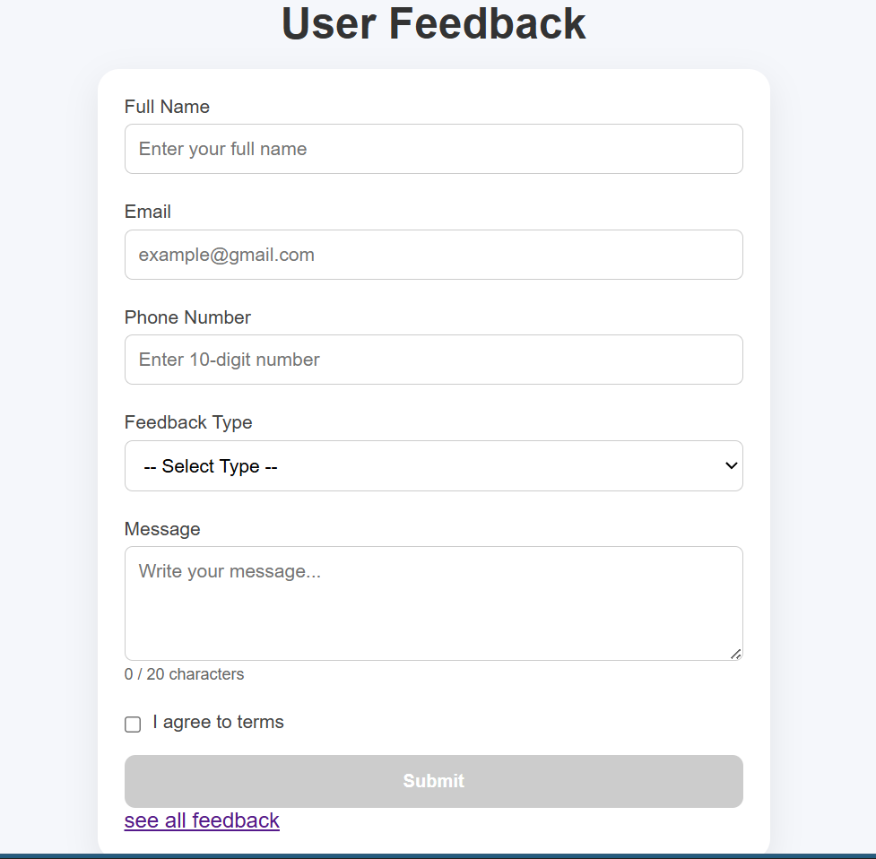
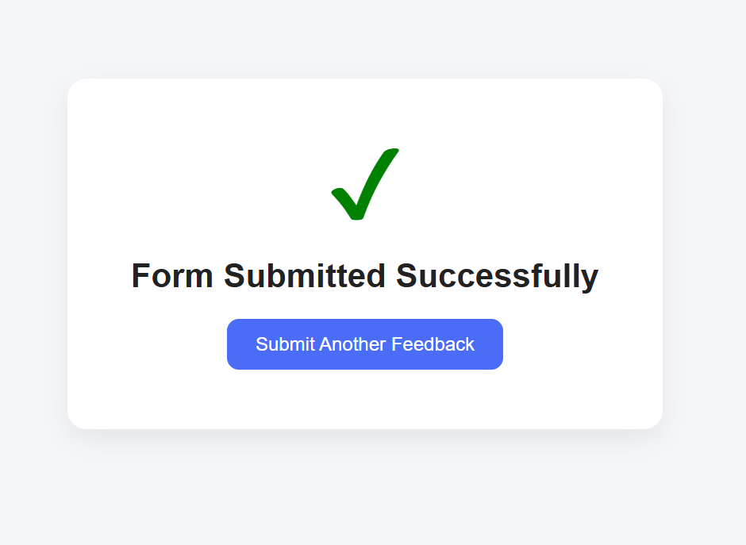
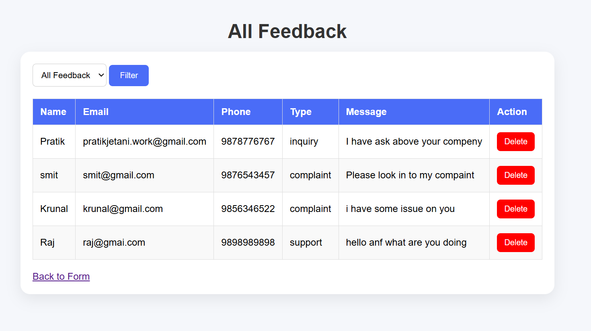

# User Feedback & Contact Management System

A simple web-based user feedback system built using **HTML, CSS, and JavaScript**.

This project allows users to submit feedback through a validated form, stores data in **localStorage**, and provides a separate page to view, filter, and delete submitted feedback.

---

## Project Overview

- DOM manipulation
- Form validation
- Event handling
- Regex validation
- Local Storage
- Dynamic table rendering(Filtering)
- Filtering and deleting data

---

## 🚀 Features

### 👨‍🔧 Feedback Form

Users can submit feedback using the following fields:

- Full Name
- Email
- Phone Number
- Feedback Type
  - Inquiry
  - Support
  - Complaint
  - General
- Message
- Terms Agreement Checkbox

---

## ⚠️ Validation Rules

The system validates all fields before submission.

### Full Name

- Cannot be empty

### Email

- Valid email format required

### Phone Number

- Must contain exactly 10 digits
- Only numeric input allowed

### Feedback Type

- User must select one option

### Message

- Minimum 20 characters required
- Live character counter included

### Terms Checkbox

- Submit button remains disabled until checked

---

## Success Flow

After successful submission:

- Data is stored in localStorage
- Form resets
- Success confirmation screen is shown
- User can submit another feedback

---

## 🚀 Feedback Page

A separate page allows:

### View All Feedback

Displays all submitted feedback in table format.

### Filter Feedback

Filter feedback by:

- Inquiry
- Support
- Complaint
- General

### Delete Feedback

Delete any feedback entry individually.

---

## 👨‍🔧 Technologies Used

- HTML5
- CSS3
- JavaScript (Vanilla JS)
- Browser Local Storage

---

## 💿 Data Storage

Feedback is stored using browser localStorage.

Storage key:

```javascript
userData;
```

---

## 📊 Learning Outcomes

Through this project, I practiced:

- Writing reusable JavaScript functions
- Form validation using regex(email and phone)
- Working with localStorage
- Dynamic DOM updates
- Improving user experience with validation feedback

---

## Screen Shot





## 🧑‍🎓 Author

**Pratik Jetani**
