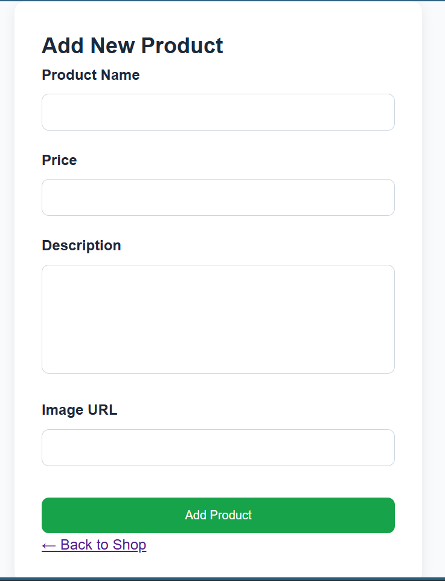
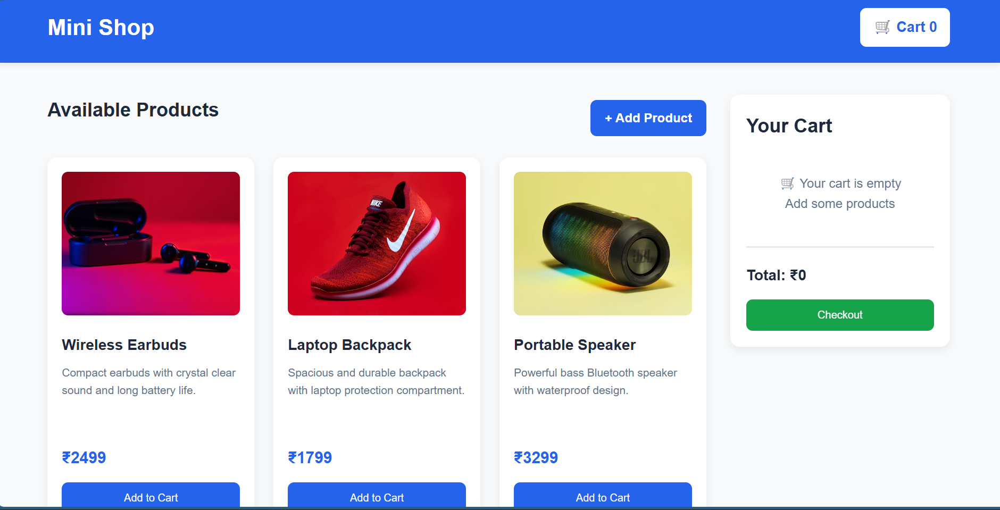
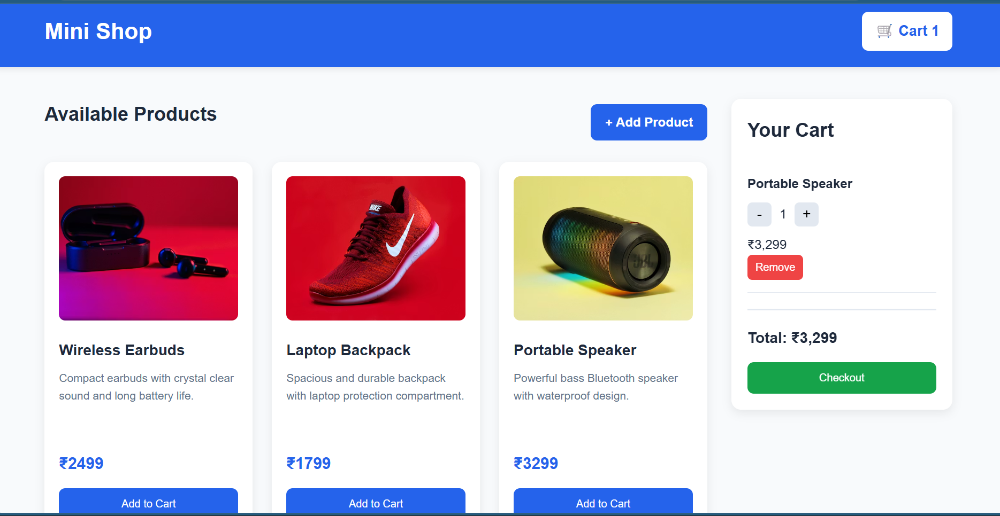

# Mini Shop - Product Listing & Cart System

## Project Overview

Mini Shop is a responsive frontend e-commerce cart application built using **HTML, CSS, and JavaScript**.

The application dynamically displays products from a JavaScript array and allows users to manage a shopping cart in real time.

Users can:

- Browse products
- Add items to cart
- Add new products using form
- Increase / decrease quantity
- Remove items
- View total price updates instantly
- Receive toast notifications
- Keep cart data saved after page refresh using localStorage

This project demonstrates practical understanding of:

- DOM manipulation
- JavaScript array methods
- Event handling
- Browser storage
- Form handling


---

## 🚀 Features

## Product Listing

Products are dynamically rendered from JavaScript data.

Each product includes:

- Product image
- Product name
- Product description
- Product price
- Add to Cart button

---

## Add Product Form

Users can add new products using a separate form page.

Form accepts:

- Product Name
- Product Price
- Product Description
- Product Image URL

Behavior:

- Validates all required fields
- Creates new product object
- Adds product dynamically
- Stores newly added product
- Product appears instantly in product listing

---

## Add to Cart

Users can add products directly to cart.

Behavior:

- If product does not exist → Added as new item
- If product already exists → Quantity increases

---

## Shopping Cart

Users can:

### Increase Quantity
Increase product quantity using **+** button.

---

### Decrease Quantity
Decrease quantity using **−** button.

If quantity reaches 0, the product is automatically removed.

---

### Remove Product
Remove item completely from cart using Remove button.

---

## Dynamic Cart Count

Header displays total number of products currently added.

Example:

```text
🛒 Cart 5
```

---

## Real-Time Total Calculation

Cart total updates automatically whenever:

- Product is added
- Quantity changes
- Product is removed

---

## Toast Notifications

Interactive toast messages appear for:

- Product added
- New product created
- Quantity increased
- Quantity decreased
- Product removed
- Empty cart warning
- Order placed successfully

---

## Checkout Functionality

Checkout button validates cart:

### If cart is empty
Displays warning notification.

### If cart contains items

- Displays order success notification
- Clears cart
- Updates localStorage

---

## Local Storage Support

Cart is saved in browser localStorage.

This allows:

- Cart persistence after page refresh
- Added products persistence
- Better user experience

---

## Technologies Used

- HTML5
- CSS3
- JavaScript (ES6)
- Browser Local Storage

---

## Core Functions

## showProducts()

Renders all available products dynamically.

---

## addProduct()

Creates and adds new product from form input.

---

## addToCart(productId)

Adds product to cart.

If already exists → Increases quantity.

---

## showCart()

Displays cart items dynamically.

---

## increaseQuantity(productId)

Increases product quantity.

---

## decreaseQuantity(productId)

Decreases quantity or removes item.

---

## removeProductFromCart(productId)

Removes selected item.

---

## calculateTotal()

Calculates total cart value.

---

## updateCartCount()

Updates header cart count.

---

## saveCart()

Stores cart data in localStorage.

---

## showToast(msg)

Displays animated toast notifications.

---

## updateCart()

Updates:

- Cart display
- Cart total
- Cart count
- Local storage

---

## init()

Initializes application.

---

## Learning Outcomes

This project helped in understanding:

- Dynamic rendering
- Cart state management
- Event-driven programming
- Form handling
- Browser localStorage
- Shopping cart logic

---

## Screen Shot


  
  

---

## Author

**Pratik Jetani**