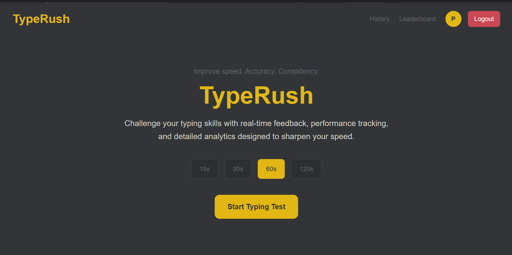
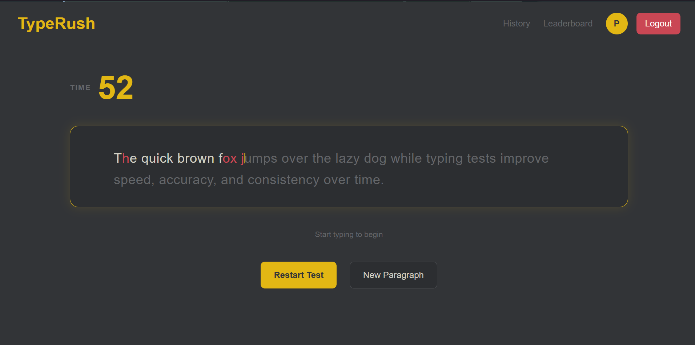
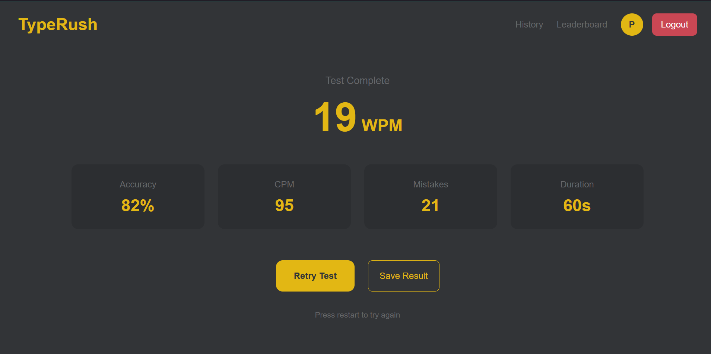
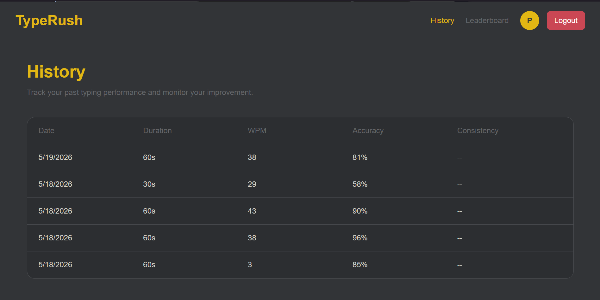
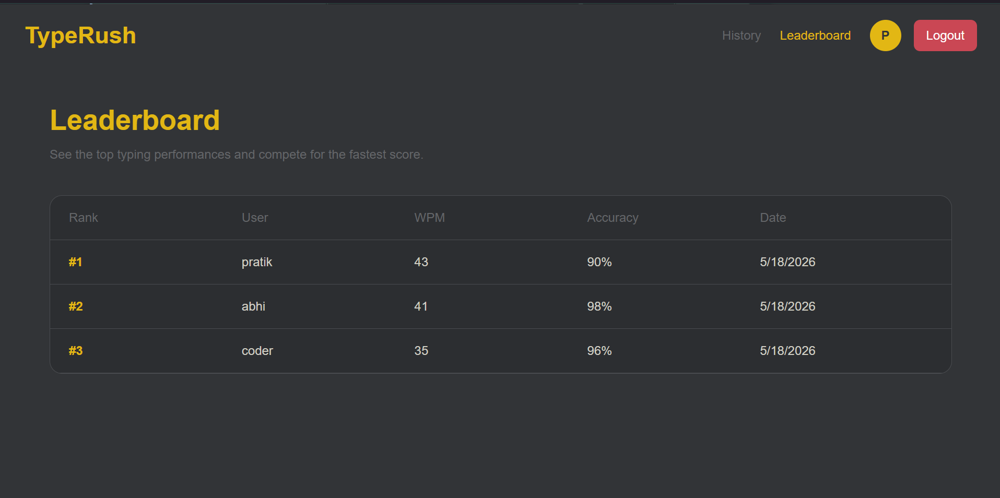

# TypeRush RTK

A modern typing speed test application built with **React, TypeScript, Tailwind CSS, and Redux Toolkit**.

TypeRush helps users improve typing speed, accuracy with real-time feedback, test history tracking, leaderboard ranking, and protected authentication flow.

This version is the **Redux Toolkit implementation** of the original TypeRush project.

---

# Live Features

## Authentication

- User Signup
- User Login
- Logout
- Persistent authentication using localStorage
- Protected routes
- Redirect unauthenticated users to login page

---

## Typing Test

- Multiple test durations
  - 15 sec
  - 30 sec
  - 60 sec
  - 120 sec
- Random paragraph generation
- Live timer countdown
- Real-time typing feedback
- Character-by-character validation
- Auto scrolling paragraph cursor
- Restart test
- New paragraph generation

---

## Performance Metrics

- **WPM** (Words Per Minute)
- **CPM** (Characters Per Minute)
- **Accuracy**
- **Mistakes**

---

## Result Management

- Save test result
- Prevent duplicate saves
- Auto reset after save

---

## History Page

- Date
- Duration
- WPM
- Accuracy
- Consistency placeholder

History is stored per user.

---

## Leaderboard

- Username
- WPM
- Accuracy
- Ranking

Sorted by highest WPM.

---

## State Management

This project uses **Redux Toolkit** for centralized state management.

### Auth Slice

- Login
- Logout
- Current user
- Authentication persistence

---

### Result Slice

- Test results
- Add result
- Persist results

---

# Tech Stack

## Frontend

- React
- TypeScript
- Tailwind CSS
- React Router DOM

## State Management

- Redux Toolkit
- React Redux

## Storage

- LocalStorage

# Project Structure

```bash
src/
│
├── components/
│   ├── Header.tsx
│   ├── ProtectedRoute.tsx
│   ├── ResultScreen.tsx
├── pages/
│   ├── HistoryPage.tsx
│   ├── HomePage.tsx
│   ├── LeaderboardPage.tsx
│   ├── LoginPage.tsx
│   ├── NotFoundPage.tsx
│   ├── SignupPage.tsx
│   ├── TestPage.tsx
├── routes/
│   ├── AppRoutes.tsx
├── store/
│   ├── hooks.ts
│   ├── store.ts
│   └── slices/
│       ├── authSlice.ts
│       └── testSlice.ts
│
├── utils/
├── constants/
├── types/
```

---

# Key Concepts Practiced

## Redux Toolkit

- createSlice
- configureStore
- reducers
- actions
- centralized state

---

## React Concepts

- Hooks
- useEffect
- useRef
- Controlled inputs
- Protected routing
- Navigation state

---

# Installation

```bash
npm install
npm run dev
```

---

## ScreenShot







# Learning Outcome

- Redux Toolkit architecture
- State persistence
- Authentication flow
- Protected routes
- Scalable React app structure

---

# Author

**Pratik Jetani**
